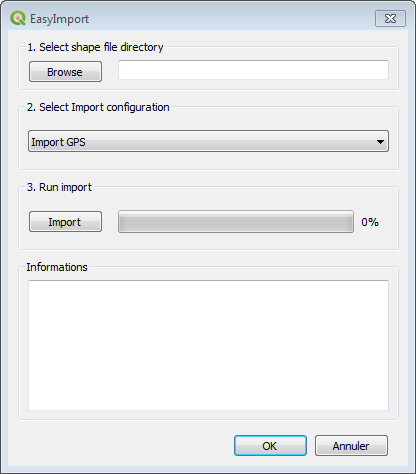

# EasyImport

Simple geocoding plugin for importing GPS point data

## Features

- Imports `.asc` or `.prn` text files to QGIS predefined QGIS layers
- Supports different import modes, such as full import or network-specific import

## Codification

Codification is defined in [config.xml](config.xml)

- `pointlayers`
  - `pointlayer.destinationlayer`: Destination layer name in QGIS project
- `columnmappings`
  - `columnmapping.source`: Column name in source data file
  - `columnmapping.destination`: Column name in the destination layer
- `staticmappings`
  - `staticmapping.value`: Static value to store in the destination column ``staticmapping.destination``

## Source file format

The format accepted by *EasyImport* is simple text file (`.asc` or `.prn`) with spaces as separators, which must comply with the following syntax: `NNNNNNabc XXXXXXX.XXX YYYYYYY.YYY ZZZ.ZZZ S.SSS CCC`

- `NNNNNN`: Point number (integer)
- `abc`: Network, only points in this network will be imported (string)
- `XXXXXXX.XXX`: X coordinate (real)
- `YYYYYYY.YYY`: Y coordinate (real)
- `ZZZ.ZZZ`: Z coordinate (real)
- `S.SSS`: Accuracy (real)
- `CCC`: code (string)
- Everything following text can be imported into the remark field

## Installation

ADD `https://raw.githubusercontent.com/VilleDePully/EasyImport/master/plugins.xml`

To your plugin repository list in QGIS

Then install or update through the dedicated menu in the QGIS plugin manager :

